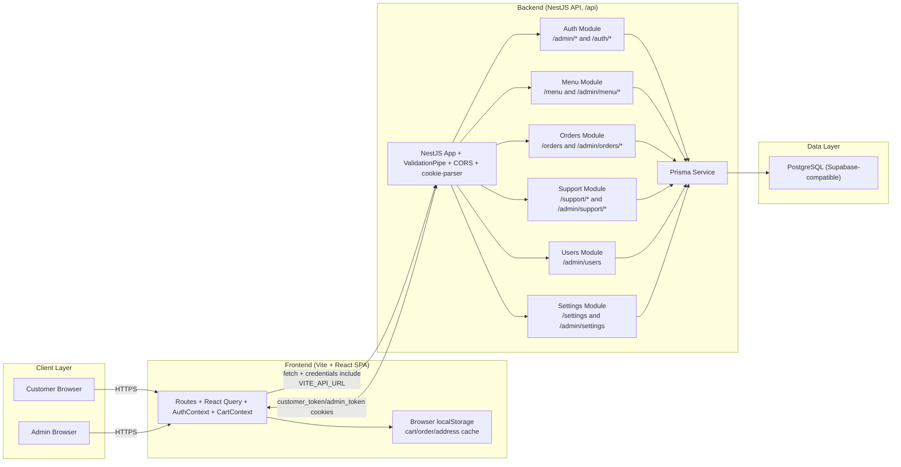
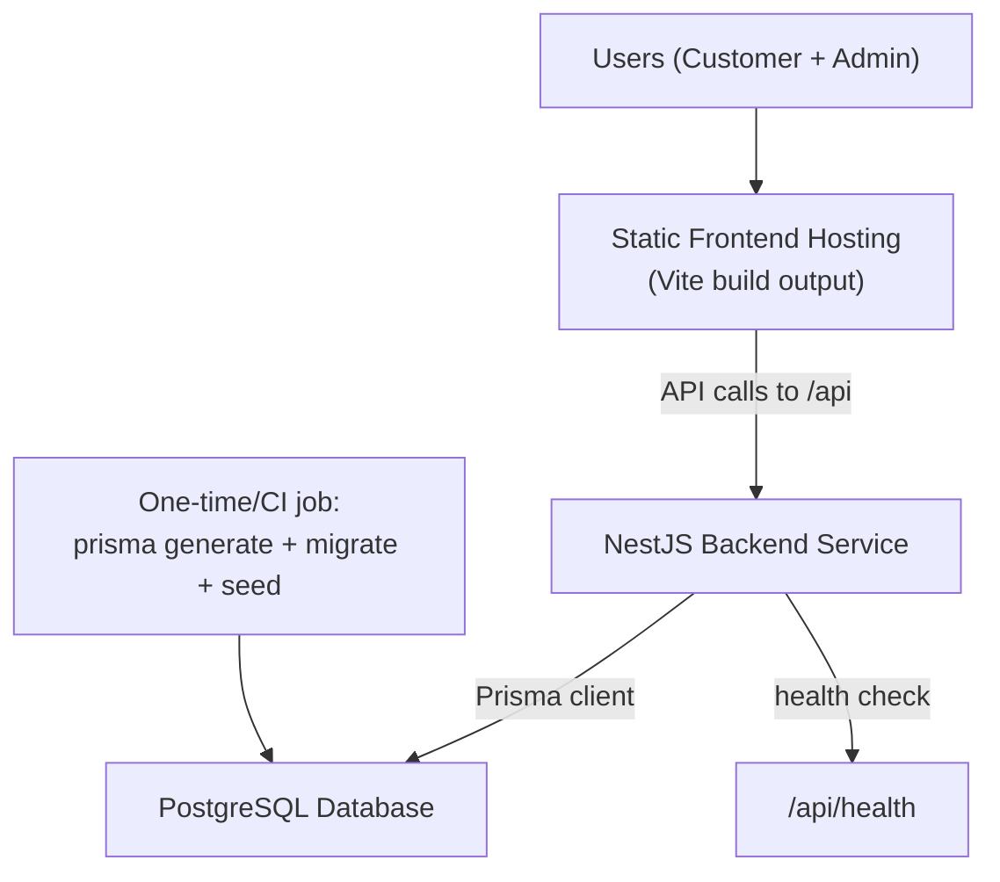

# BurgerBoyz Architecture

## 1) High-level system architecture

## 2) Deployment topology

## 2.1) Deployment UML (target hosting)

- UML deployment source is at `docs/deployment-uml.puml`.
- This diagram is aligned with your target:
  - Frontend on Netlify
  - Backend on Railway
  - Database on Supabase Postgres

## 3) Runtime boundaries and responsibilities

- Frontend is a client-side SPA in `src/App.tsx` using `react-router-dom` and `@tanstack/react-query`.
- Backend is a NestJS API in `backend/src/main.ts` with global prefix `/api`, cookie auth, DTO validation, and CORS.
- Data persistence is PostgreSQL through Prisma models in `backend/prisma/schema.prisma`.
- Authentication is cookie-based JWT with `admin_token` for admin routes and `customer_token` for customer routes.
- Orders are currently cash-only (backend rejects non-cash payments).

## 4) Environment variables to configure

| Scope | Variable | Purpose |
| --- | --- | --- |
| Frontend | `VITE_API_URL` | API base URL, e.g. `https://api.yourdomain.com/api` |
| Backend | `PORT` | API port (default `3001`) |
| Backend | `FRONTEND_ORIGIN` | Comma-separated allowed frontend origins for CORS |
| Backend | `DATABASE_URL` | Prisma runtime DB connection |
| Backend | `DIRECT_URL` | Direct DB connection for Prisma migrations |
| Backend | `JWT_SECRET` | JWT signing secret |
| Backend | `JWT_EXPIRES_IN` | Token TTL (default `7d`) |
| Backend | `COOKIE_DOMAIN` | Cookie domain (`localhost` in local dev) |
| Backend | `COOKIE_SECURE` | Set `true` under HTTPS |
| Backend | `ADMIN_EMAIL`, `ADMIN_PASSWORD` | Used by `prisma:seed` admin bootstrap |

## 5) Minimal deployment sequence

1. Provision PostgreSQL and set backend env vars (`DATABASE_URL`, `DIRECT_URL`, `JWT_SECRET`, cookie and CORS values).
2. Initialize backend: `cd backend && npm install && npm run prisma:generate && npm run prisma:migrate && npm run prisma:seed`.
3. Start backend.
4. For local dev run `npm run start:dev` from `backend`.
5. For production run `npm run build && node dist/main.js` from `backend`.
6. Build frontend with API base set: `npm install && VITE_API_URL=<your-api>/api npm run build`.
7. Deploy frontend `dist/` to static hosting.
8. Verify `GET /api/health`, customer ordering flow, and admin ordering flow.

## 6) Railway production guide

- Detailed step-by-step guide: `docs/railway-backend-deployment-guide.md`
